## 3D Models

Note: All parts were designed to be printed without the need for any support

### Assembly 1. Body
This is the central part of the bot, technically called the  tetrapod torso. It is basically the body of an animal without the 4 shoulders, limbs, head or buttock.

- It contains all the electronic components including the battery, except the LCD and the servos.
- Technically, the SBEC Cover and the Board Cover are optional. They can be skipped for now and printed at the end

|Assembly No|Assembly Name|Part|File Path|Count|Image||
|--|--|--|--|--|--|--|
|1|Body|Plate|3dModels/Body/Plate.stl|x1|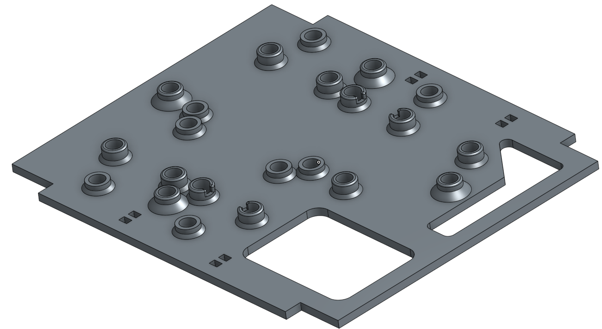||
|1|Body|Side|3dModels/Body/Side.stl|x2|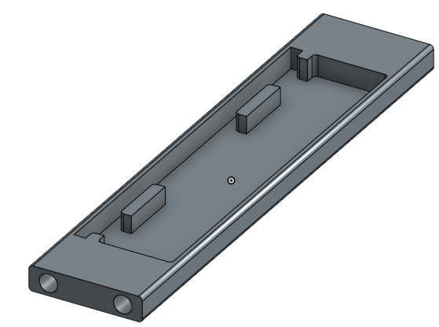||
|1|Body|Battery Cover|3dModels/Body/Battery Cover.stl|x1||optional|
|1|Body|SBEC Cover|3dModels/Body/SBEC Cover.stl|x1||optional|
|1|Body|Boards Cover|3dModels/Body/Boards Cover.stl|x1||optional|

### Assembly 2. Front/Rear Shoulders

- This assembly is the shoulders cage that holds the Z-axis servos
- You will need two copies of this assembly
- Note that the limbs of the rear shoulders are reverse when compared to the front shoulders (left is right and right is left). More on that later

|Assembly No|Assembly Name|Part|File Path|Count|Image||
|--|--|--|--|--|--|--|
|2|Front/Rear Shoulders|Inner Shoulder Plate|3dModels/Shoulders/Inner Plate/Inner Shoulder Plate.stl|x2||
|2|Front/Rear Shoulders|Left Shoulder Limb Cover|3dModels/Shoulders/Limb/Left/Left Shoulder Limb Cover.stl|x2||
|2|Front/Rear Shoulders|Left Shoulder Limb|3dModels/Shoulders/Limb/Left/Left Shoulder Limb.stl|x2||
|2|Front/Rear Shoulders|Right Shoulder Limb Cover|3dModels/Shoulders/Limb/Right/Right Shoulder Limb Cover.stl|x2||
|2|Front/Rear Shoulders|Right Shoulder Limb|3dModels/Shoulders/Limb/Right/Right Shoulder Limb.stl|x2||
|2|Front/Rear Shoulders|Outer Shoulder Plate|3dModels/Shoulders/Outer Plate/Outer Shoulder Plate.stl|x2||

### Assembly 3. Left Leg
|Assembly No|Assembly Name|Part|File Path|Count|Image||
|--|--|--|--|--|--|--|
|3|Left Leg|Shoe|3dModels/Legs/Shoe.stl|x2|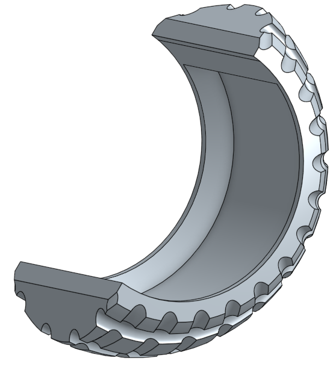|
|3|Left Leg|Left Foot Base|3dModels/Legs/Left/Foot/Left Foot Base.stl|x2||
|3|Left Leg|Left Foot Inner|3dModels/Legs/Left/Foot/Left Foot Inner.stl|x2||
|3|Left Leg|Left Foot Outer|3dModels/Legs/Left/Foot/Left Foot Outer.stl|x2||
|3|Left Leg|Bearing End|3dModels/Legs/Left/Leg/Bearing End.stl|x2||
|3|Left Leg|Cover|3dModels/Legs/Left/Leg/Cover.stl|x2||
|3|Left Leg|Left Leg|3dModels/Legs/Left/Leg/Left Leg.stl|x2||
|3|Left Leg|Servo End|3dModels/Legs/Left/Leg/Servo End.stl|x2||

### Assembly 4. Right Leg
|Assembly No|Assembly Name|Part|File Path|Count|Image||
|--|--|--|--|--|--|--|
|4|Right Leg|Shoe|3dModels/Legs/Shoe.stl|x2||
|4|Right Leg|Right Foot Base|3dModels/Legs/Right/Foot/Right Foot Base.stl|x2||
|4|Right Leg|Right Foot Inner|3dModels/Legs/Right/Foot/Right Foot Inner.stl|x2||
|4|Right Leg|Right Foot Outer|3dModels/Legs/Right/Foot/Right Foot Outer.stl|x2||
|4|Right Leg|Bearing End|3dModels/Legs/Right/Leg/Bearing End.stl|x2||
|4|Right Leg|Cover|3dModels/Legs/Right/Leg/Cover.stl|x2||
|4|Right Leg|Right Leg|3dModels/Legs/Right/Leg/Right Leg.stl|x2||
|4|Right Leg|Servo End|3dModels/Legs/Right/Leg/Servo End.stl|x2||

### Assembly 5. Top & Bottom Covers
Two very similar parts that wrap the body (the previous assembly). One cover goes on the top and the other on the bottom.

- The top cover has two openings, one for a power switch and another for accessing the battery charging connector
- The bottom cover has two optional parts that I call "offsets". They maybe needed if extra room is desired.

|Assembly No|Assembly Name|Part|File Path|Count|Image||
|--|--|--|--|--|--|--|
|5|Top/Bottom Covers|Bottom Panel|3dModels/Bottom/Bottom Panel.stl|x1||
|5|Top/Bottom Covers|Edge Panel Connector|3dModels/Bottom/Edge Panel Connector.stl|x4||
|5|Top/Bottom Covers|Left Side Panel|3dModels/Bottom/Left Side Panel.stl|x2||
|5|Top/Bottom Covers|Offset|3dModels/Bottom/Offset.stl|x2|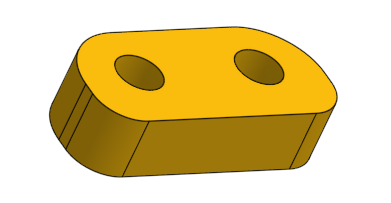|
|5|Top/Bottom Covers|Right Side Panel|3dModels/Bottom/Right Side Panel.stl|x2||
|5|Top/Bottom Covers|Charging Cover|3dModels/Top/Charging Cover.stl|x1||
|5|Top/Bottom Covers|Top Cover with Opening|3dModels/Top/Top Cover with Opening.stl|x1||

### Assembly 6. Head
|Assembly No|Assembly Name|Part|File Path|Count|Image||
|--|--|--|--|--|--|--|
|6|Head|Connector|3dModels/Head/Connector.stl|x1|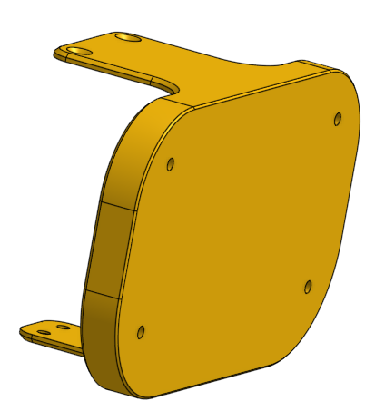|
|6|Head|Face|3dModels/Head/Face.stl|x1|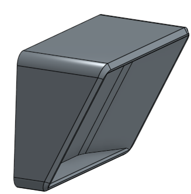|
|6|Head|Middle|3dModels/Head/Middle.stl|x1|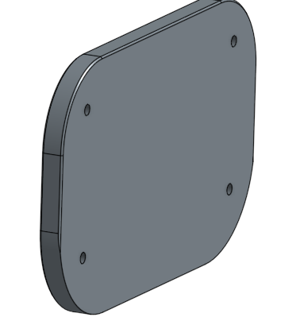|
|6|Head|Nose|3dModels/Head/Nose.stl|x1|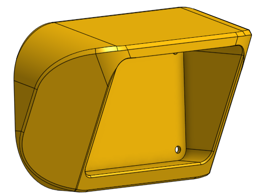|

### Assembly 7. Rear
|Assembly No|Assembly Name|Part|File Path|Count|Image||
|--|--|--|--|--|--|--|
|7|Rear|Rear Cover|3dModels/Rear/Rear Cover.stl|x2|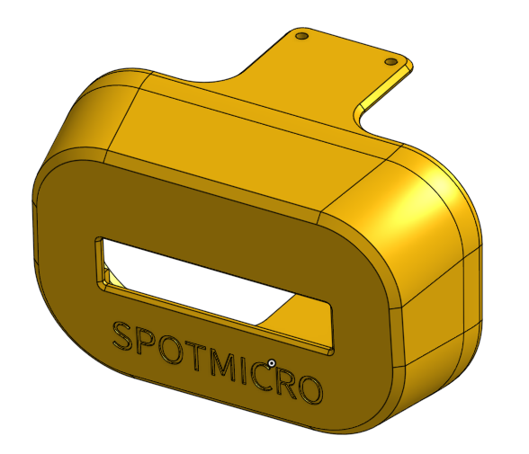|

### Assembly 8. Stand

- Technically, this assembly is optional, but it is very difficult to calibrate and test the robot without it

|Assembly No|Assembly Name|Part|File Path|Count|Image||
|--|--|--|--|--|--|--|
|8|Stand|Base|3dModels/Stand/Base x 2.stl|x2|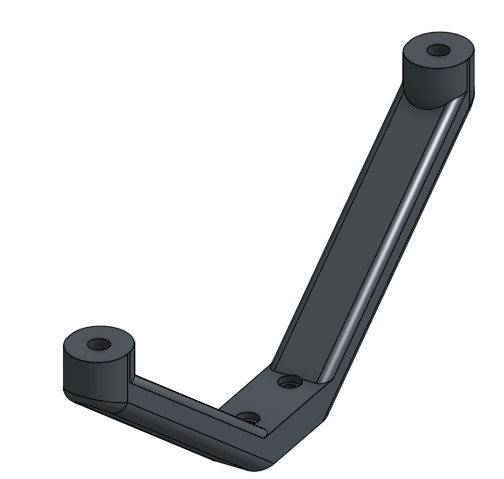|
|8|Stand|Cross Beam|3dModels/Stand/Cross Beam x 2.stl|x2||
|8|Stand|Foot|3dModels/Stand/Foot x 4.stl|x4|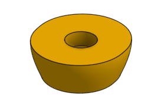|
|8|Stand|Fork|3dModels/Stand/Fork x 2.stl|x2|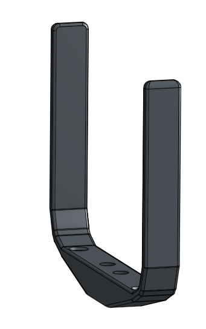|
|8|Stand|Stem|3dModels/Stand/Stem x 2.stl|x2|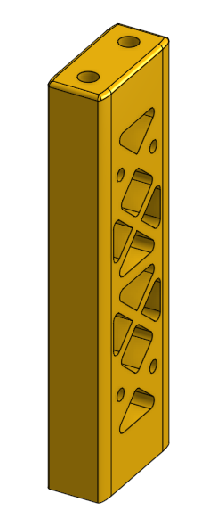|